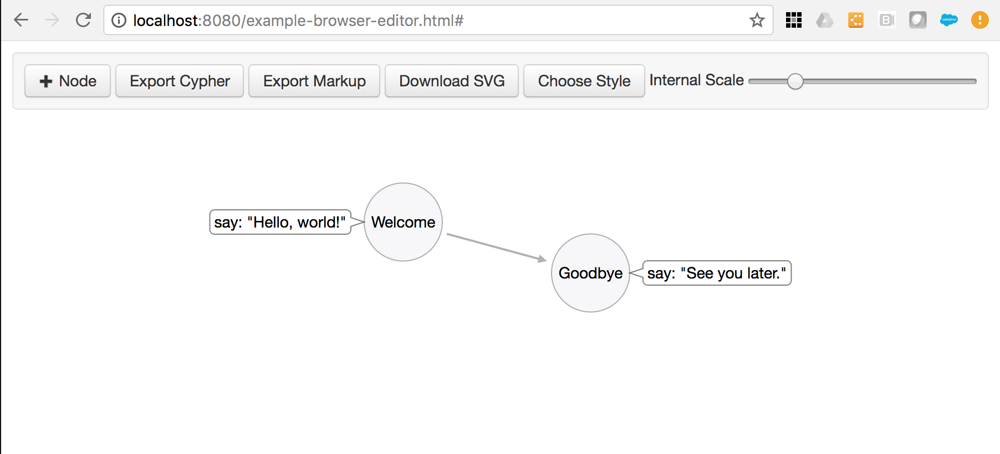
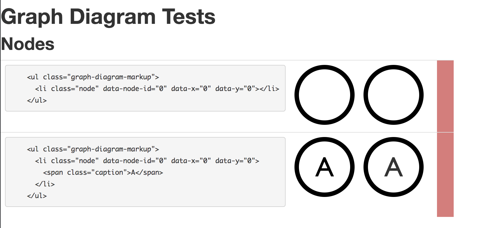

# graph-diagram

### About
graph-diagram is a TypeScript library version of apcjones Arrows project: github.com/apcj/arrows

In-browser examples of graph-diagram are at:

- editor: [https://wwlib.github.io/graph-diagram/examples/example-browser-editor.html?#](https://wwlib.github.io/graph-diagram/examples/example-browser-editor.html?#)

- tests: [https://wwlib.github.io/graph-diagram/examples/example-browser-tests.html?#](https://wwlib.github.io/graph-diagram/examples/example-browser-tests.html?#)

- [https://wwlib.github.io/graph-diagram/](https://wwlib.github.io/graph-diagram/)

Note: This is a first-pass, straight port. Refactoring and optimization is next.

Dependency: graph-diagram requires d3 to be installed

### npm
`npm install graph-diagram d3`

### contributing: install, build
```
git clone git@github.com:wwlib/graph-diagram.git
cd graph-diagram
npm install
npm run build
```

### in-browser examples

#### in-browser editor:
```
npm run build:example-browser-editor
cd docs/examples
http-server
```
[http://localhost:8080/example-browser-editor.html?#](http://localhost:8080/example-browser-editor.html?#)



#### in-browser tests:
```
npm run build:example-browser-tests
cd docs/examples
http-server
```
[http://localhost:8080/example-browser-tests.html](http://localhost:8080/example-browser-tests.html)



### tests, coverage
Note: Tests are incomplete

`npm run test`

`npm run coverage`
